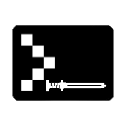

# SharpCLI

<br>

---
[](https://www.nuget.org/packages/sharpcli)
[](https://github.com/huneriann/sharpcli/actions/workflows/publish.yml)
---

> 🚀 **A modern, attribute-based CLI framework for .NET** 

Transform your methods into powerful CLI commands using simple attributes with automatic arguments parsing, help
generation, and async support.

## ✨ Features

- **🎯 Method-Based Commands** - Turn any method into a CLI command with a simple attribute
- **📝 Attribute-Driven** - Use `[Command]`, `[Argument]`, and `[Option]` attributes to define your CLI
- **🔧 Automatic Parsing** - Built-in argument parsing with type conversion and validation
- **📚 Auto-Generated Help** - Beautiful help text generated from your attributes
- **⚡ Async Support** - Full support for async commands with `Task<int>` and `Task`
- **🏷️ Command Aliases** - Multiple ways to invoke the same command
- **🎨 Type Safety** - Strongly-typed parameters with compile-time checking
- **🚀 Zero Dependencies** - Lightweight with no external dependencies

## 🚀 Quick Start

### 1. Define Your Commands
```csharp
    public static class Commands
    {
        // Basic command
        [Command("--version", Description = "Show version")]
        public static int Version() 
        {
            Console.WriteLine("v1.0.0"); 
            
            return 0;
        }
        
        // Command with an argument and options
        [Command("greet", Description = "Greet someone", Aliases = ["hello", "hi"])]
        public static int Greet(
            [Argument("name", Description = "Person to greet")] string name,
            [Option("m", "message", Description = "Custom message")] string message = "Hello",
            [Option("c", "count", Description = "Times to greet")] int count = 1)
        {
            for (int i = 0; i < count; i++)
            {
                Console.WriteLine($"{message}, {name}!");
            }
            return 0;
        }
    }
```

### 2. Register and Run
```csharp
    public static async Task<int> Main(string[] args)
    {
        var app = new SharpCliHost("fast-cli-app", "An awesome CLI application")
            .RegisterCommands<Commands>();
    
        return await app.RunAsync(args);
    }
```

### 3. Use Your CLI
```
    # Greet someone
    fast-cli-app greet Alex
    
    # Use options
    fast-cli-app greet Bob --message "Hi there" --count 3
    
    # Use short options
    fast-cli-app hello Charlie -m "Hey" -c 2
    
    # Get help
    fast-cli-app --help
    fast-cli-app greet --help
```

## 🏗️ Advanced Features

### Async Commands
```csharp
    [Command("download")]
    public static async Task<int> Download(
        [Argument("url")] string url,
        [Option("o", "output")] string output = "download")
    {
        // Async implementation
        await DownloadFileAsync(url, output);
        return 0;
    }
```

### Complex Types
```csharp
    [Command("deploy")]
    public static int Deploy(
        [Argument("environment")] Environment env, // Enum support
        [Option("t", "timeout")] TimeSpan timeout = default) // Custom types
    {
        // Implementation
    }
```

## 📦 Installation
```text
    dotnet add package SharpCli
```

## 📄 License
This project is licensed under the MIT License - see the [MIT License](https://github.com/huneriann/sharpcli/blob/master/LICENSE.md) file for details.
